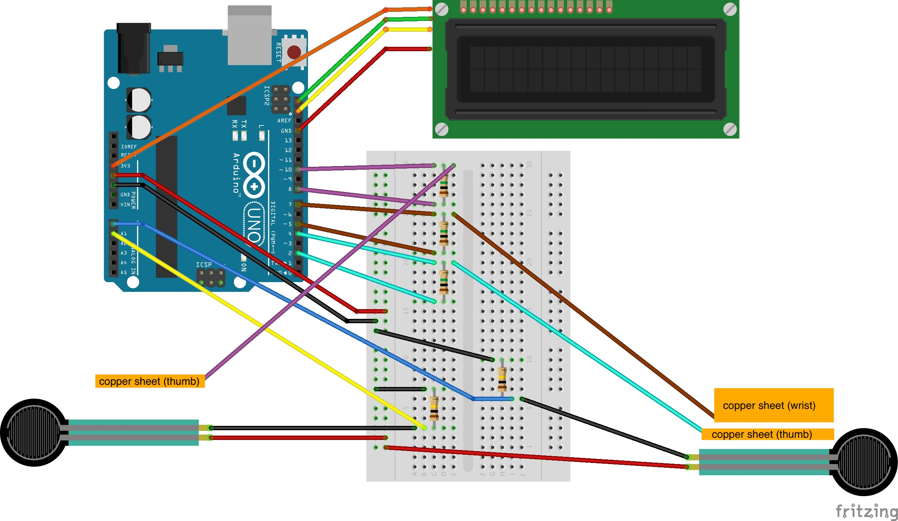
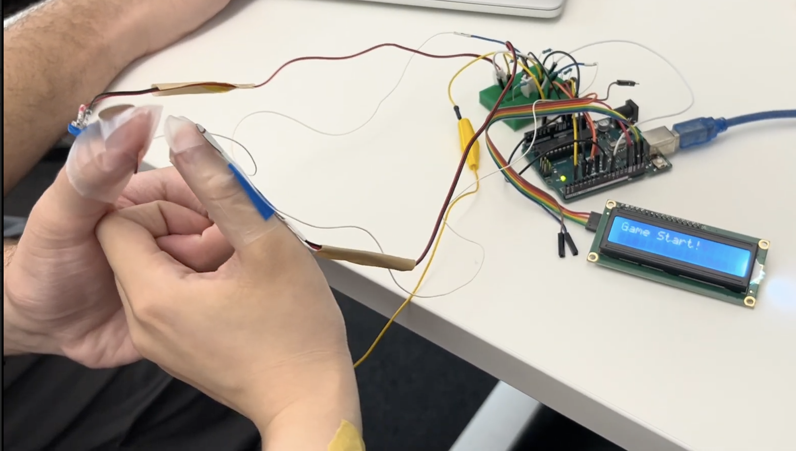
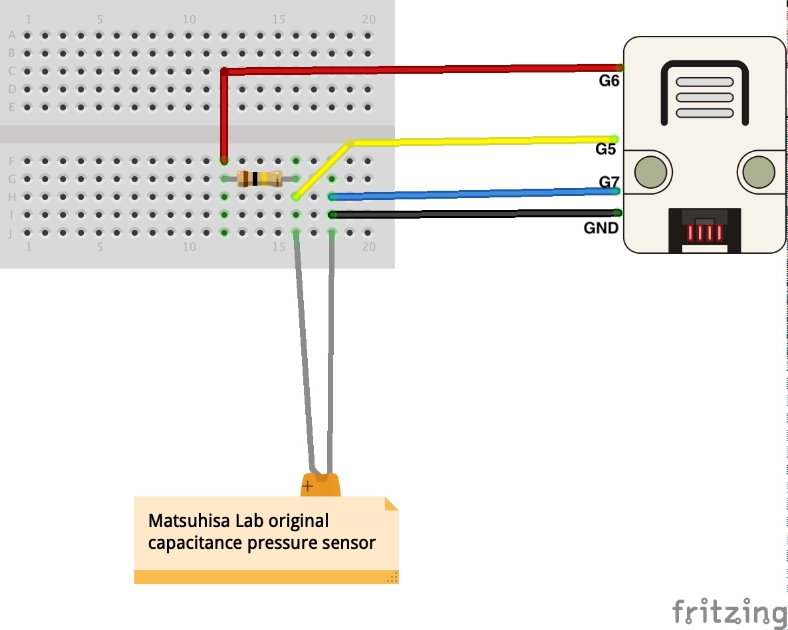
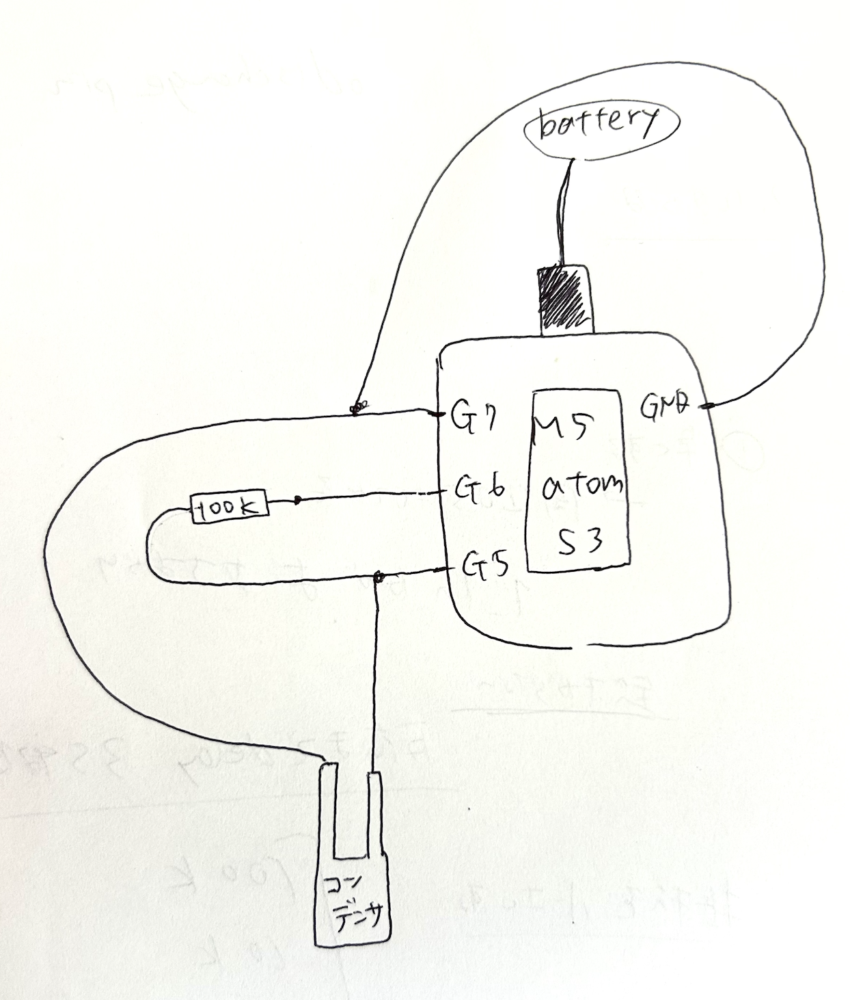
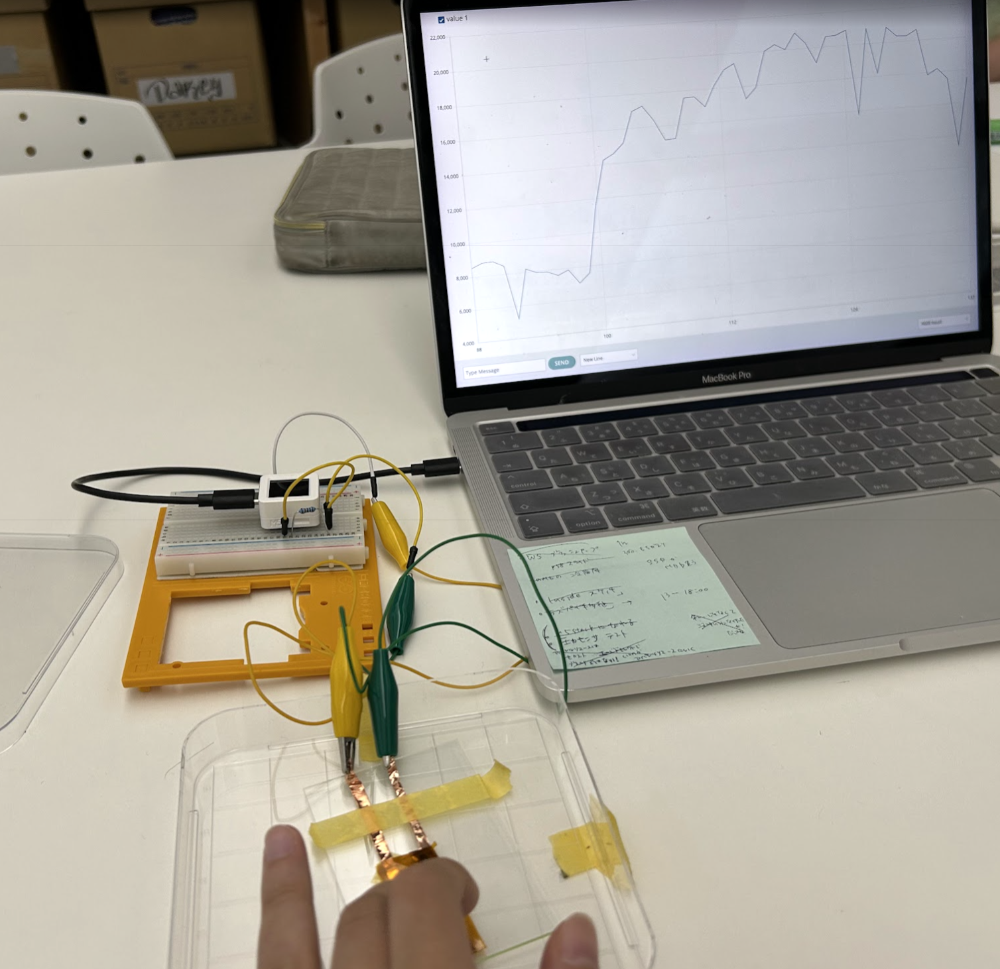
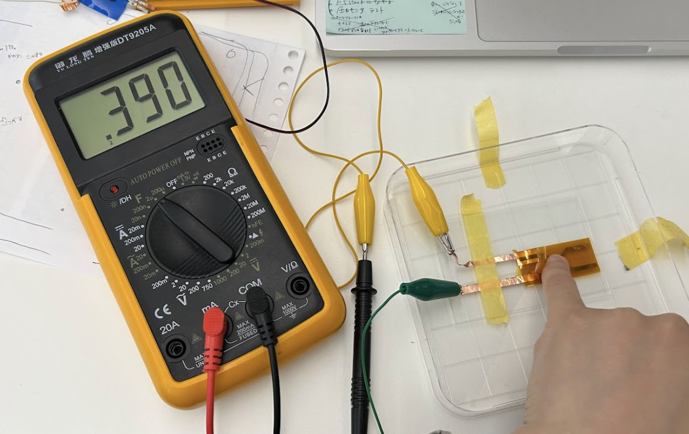
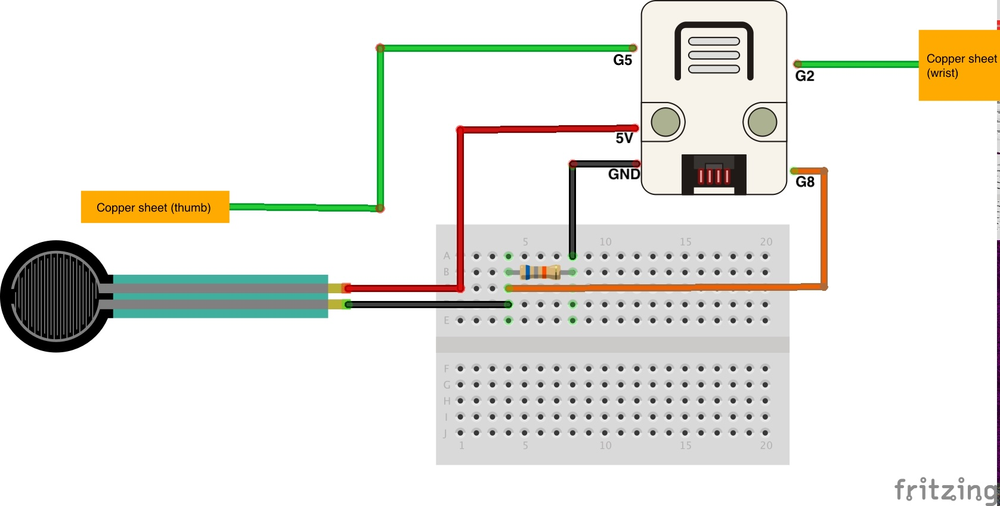
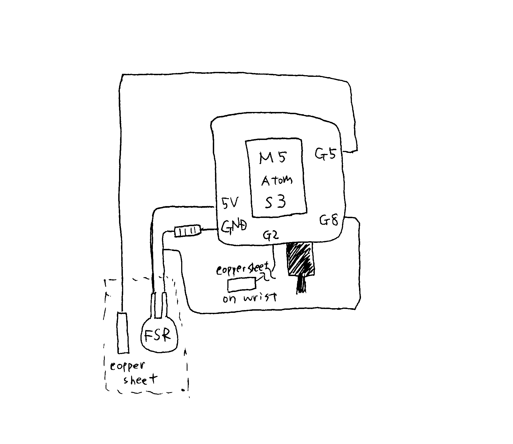

# Hands 2.0 README

Treasure hunting project 2025 in collaboration with Matsuhisa Lab aiming to develop an "invisible" wearable device for thumb wrestling.

_Status: Ongoing

_Last updated: August 2025 documented by Tamaki

## 📁 Software

Each script runs individually

- `Arduino_thumbwrestling.ino`  
   Arduino sketch for the **first prototype** of a judge system, using a single Arduino as the main controller.

   Video on https://drive.google.com/file/d/1VUcGh0xSxG4f2ZdRcVpi-l9c60P2i8LT/view?usp=drive_link

   _Note: We have since evolved the concept into a system with two stand-alone devices._

- `M5_capacitance.ino`  
   Script to measure the capacitance of Matsuhisa Lab’s original pressure sensor.

- `M5_thumbwrestling_com1.ino`  
   Script for thumb wrestling judge system with 3 data (touch, handshake, pressure value) displayed on M5.

   Video on https://drive.google.com/file/d/1QNyZTJC7033aZxt6TYxbK8tVRA3WX5ky/view?usp=drive_link

- `M5_thumbwrestling_com2.ino`

   A step up from `M5_thumbwrestling_com1.ino`.
   It includes dummy opponent data and makes judgments based on information from both players.
   Replace the dummy values with the communicated ones.

- `M5_thumbwrestling_onejudge.ino`

   A step behind from `M5_thumbwrestling_com1.ino`.
   Only the loser judges the game when he is pressed for 5 seconds.
  

## ⚙️ Hardware

- Arduino UNO for `Arduino_thumbwrestling.ino`  
- M5 Atom S3 for `M5_capacitance.ino`, `M5_thumbwrestling_com1.ino`, `M5_thumbwrestling_com2.ino`, and `M5_thumbwrestling_onejudge.ino`.

## 🛠️ Wiring and Behaviour

### Arduino_thumbwrestling.ino

**How it works**
1. The game starts when both players join hands — detected by changes in the capacitance of wrist-mounted touch sensors.  
   If either player lets go during the game, the system resets.

2. The display shows the states of the game

3. Either of the players wins when he presses the opponent's thumb for 5 seconds.
   

**Threshold Configuration**

These parameters are defined at the beginning of the script:

- Wrist touch sensor threshold  
- Pressure sensor threshold  
- Thumb touch sensor threshold  
- Required time to register a win: **5 seconds**

### M5_capacitance.ino

**How to select the resistor value**

The resistor between the capacitance sensor and M5 influences the sensitivity and the response delay.
For the first-gen capacitive sensor,  
68k と51k

**How to measure the capacitance with a tester**

### M5_thumbwrestling_com1.ino

**Operation**
1. 各プレイヤーが手首につけているタッチセンサのキャパシタンスの変化によってプレイヤー同士が手を組んだことを表示します. ゲーム中にプレイヤーが手を離せばゲームはリセットされます。
2. 親指の爪の上の圧力センサが押されているかどうか、親指の腹のタッチせんさ（今後圧力センサに変更予定）が触れているかどうかを判定する
3. 一つのarduinoが、読み取った情報を元に勝敗を判定する。
 4. 
   - Whether the **pressure sensor** on the thumbnail is being pressed.
   - Whether the **touch sensor** on the pad of the thumb (planned to be replaced with a pressure sensor) is being activated.

5. These signals (a, b, c) are sent to the opponent’s device.  
   Each device receives the other’s signals and determines the game result accordingly.
