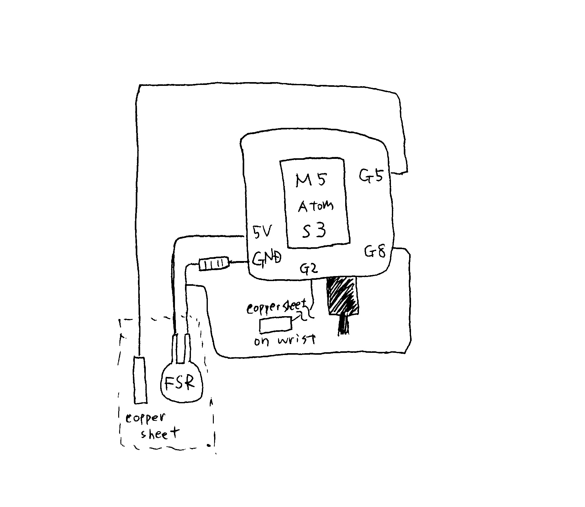

# Hands 2.0 README

Treasure hunting project 2025 in collaboration with Matsuhisa Lab aiming to develop an "invisible" wearable device for thumb wrestling.

_Status: Ongoing
_Last updated: August 2025 documented by Tamaki

## 📁 Software

Each script runs individually

- `standalone_thumbwrestling.ino`  
   Arduino sketch for thumb wrestling (stand-alone version).

- `M5_capacitance.ino`  
   Arduino sketch to measure the capacitance of Matsuhisa Lab’s original pressure sensor.

- `wired_thumbwrestlingjudge.ino`  
   Arduino sketch for the **first prototype** of a thumb wrestling judge system, using a single Arduino as the main controller.  
   _Note: We have since evolved the concept into a system with two stand-alone devices._

## ⚙️ Hardware

- M5 Atom S3 for `standalone_thumbwrestling.ino` and `M5_capacitance.ino`
- Arduino UNO for `wired_thumbwrestlingjugde.ino`

## 🛠️ Wiring and Behavior

### standalone_thumbwrestling.ino

**How it works**
1. The game starts when both players join hands — detected by changes in the capacitance of wrist-mounted touch sensors.  
   If either player lets go during the game, the system resets.

2. The display shows:
   - Whether the **pressure sensor** on the thumbnail is being pressed.
   - Whether the **touch sensor** on the pad of the thumb (planned to be replaced with a pressure sensor) is being activated.

3. These signals (a, b, c) are sent to the opponent’s device.  
   Each device receives the other’s signals and determines the game result accordingly.

**Threshold Configuration**

These parameters are defined at the beginning of the script:

- Wrist touch sensor threshold  
- Pressure sensor threshold  
- Thumb touch sensor threshold  
- Required time to register a win: **5 seconds**

### M5_capacitance.ino

resiterの選び方

### wired_thumbwrestlingjugde.ino

以下のようにつないでください

**Operation**
1. 各プレイヤーが手首につけているタッチセンサのキャパシタンスの変化によってプレイヤー同士が手を組んだことを表示します. ゲーム中にプレイヤーが手を離せばゲームはリセットされます。
2. 親指の爪の上の圧力センサが押されているかどうか、親指の腹のタッチせんさ（今後圧力センサに変更予定）が触れているかどうかを判定する
3. 一つのarduinoが、読み取った情報を元に勝敗を判定する。
